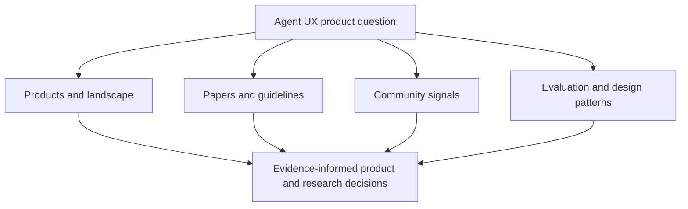

# Awesome Agent UX Research

**An evidence-minded field guide to AI agent UX, UX research for agents, and the human–AI interaction patterns that matter in real products.**

I built this collection because the useful material was scattered across several conversations that rarely meet in one place: agent frameworks, human–AI interaction research, UX practice, synthetic evaluation, browser infrastructure, and the experience of people trying these systems in the real world.

This is a curated starting point, not an exhaustive link dump. Sources are organized around product and research questions so that builders, founders, designers, and researchers can move from “what is happening in this field?” to “what should we investigate or design differently?”

*The collection is organized as a decision aid: four evidence surfaces converge on practical product, design, and research questions.*

## Start with the question you are trying to answer

- **What products and infrastructure already exist?** Read [Products and Landscape](docs/products-and-landscape.md).
- **What does research already tell us?** Read [Papers and Guidelines](docs/papers-and-guidelines.md).
- **What are practitioners and users noticing in the wild?** Read [Community Signals](docs/community-signals.md).
- **What should a team evaluate or design for?** Read [Evaluation and Design Patterns](docs/evaluation-and-design-patterns.md).
- **Want to add a source?** Read the [contribution guide](CONTRIBUTING.md).

## Why this field guide exists

There are already strong collections for agent frameworks, agent papers, evaluation tooling, and orchestration patterns. There is much less GitHub-native curation at the overlap of:

- agent products
- UX research and product design
- human–AI interaction
- practical evaluation of real agent experiences

That overlap is where questions about comprehension, control, trust calibration, recovery, and human review become product decisions. This repository is meant to make that space easier to see and use.

## How I curate it

I prefer entries that are:

- grounded in primary sources or clearly labeled practitioner evidence
- specific about what the source contributes and why it matters
- useful for a product, design, or research decision
- honest about the boundary between measured behavior, interpretation, and speculation

The aim is not to manufacture consensus. Conflicting evidence and unresolved questions are part of the map.

## Good Starting Questions

- How should we evaluate whether an agentic product is usable, not just functional?
- Where do synthetic users help, and where do they fail?
- What product patterns increase trust in AI agents?
- What should an app-building agent send to a UX research service, and what should it get back?
- How should teams decide when an agent should proceed, ask a human, or stop?

## Seed Resources

GitHub collections and papers:

- [Awesome Human-AI Interaction](https://github.com/bwang514/awesome-HAI)
- [Human-AI Collaboration Literature](https://github.com/janetyc/literature-human-ai-collaboration)
- [Awesome LLM-Powered Agent](https://github.com/hyp1231/awesome-llm-powered-agent)
- [Awesome LLM Agents](https://github.com/kaushikb11/awesome-llm-agents)
- [Guidelines for Human-AI Interaction](https://www.microsoft.com/en-us/research/publication/guidelines-for-human-ai-interaction/)

Products and platforms:

- [Uxia](https://www.uxia.app/)
- [Crowdi](https://www.crowdi.org/)
- [Loop11](https://www.loop11.com/)
- [Browserbase](https://www.browserbase.com/)
- [Stagehand](https://www.stagehand.dev/)
- [QA Wolf](https://www.qawolf.com/platform)
- [Replit Agent](https://replit.com/ai)
- [v0](https://v0.dev/)
- [Lovable](https://lovable.dev/)

Community signals:

- [r/SaaS discussion on simulated user behavior](https://www.reddit.com/r/SaaS/comments/1ijkxfi)
- [r/UXResearch thread on user proxies](https://www.reddit.com/r/UXResearch/comments/1c0oq4n)
- [Replit community thread on agent quality decline](https://www.reddit.com/r/replit/comments/1hcrt2r)
- [Hacker News launch for Propolis](https://news.ycombinator.com/item?id=45762012)

## Contribution style

Prefer entries that are:

- evidence-backed
- linked to primary sources
- specific about why the source matters
- categorized in a way that helps product teams make decisions

If you add a source, include one sentence on what it is and one sentence on why it matters for agent UX.

## Scope

Include:

- product landscape notes for tools related to synthetic testing, agent QA, browser agents, and UX research
- human-AI interaction papers and practical design guidelines
- community discussion threads that reveal what builders and researchers actually trust or reject
- evaluation methods for agent usability, trust calibration, override, and handoff
- GitHub repos, papers, docs, and public writeups that help teams design better agent experiences

Do not include:

- generic AI news
- unrelated LLM tooling
- random prompt collections without UX relevance
- implementation code unless it is directly useful for evaluation or UX research

## How this connects to the working experiments

This field guide supports a broader set of product and design explorations:

- [AI Agent UX Research Platform](https://github.com/mphaxise/ai-agent-ux-research-platform) — research and design probes for agent UX validation, observability, and human review.
- [Design Skill Pack for AI Agent Coding Platforms](https://github.com/mphaxise/design-skill-pack-for-ai-agent-coding-platforms) — working design and research workflows for coding agents.
- [GStack Port for Codex](https://github.com/mphaxise/gstack-port-for-codex) — a practical study in adapting high-rigor workflows across agent runtimes.

The collection is the field map; those repositories are where I turn parts of the map into testable product ideas and working systems.
